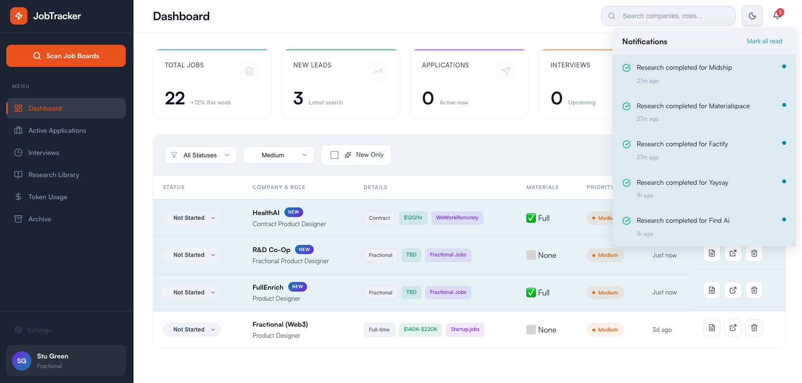

# ProwlA 🐾

An agentic job hunting assistant. Track applications, research companies, and generate personalized materials — manually or with AI agents.

[](https://opensource.org/licenses/MIT)



## Why ProwlA?

Job hunting is tedious. You're juggling spreadsheets, researching companies, writing cover letters, and tracking where you applied. ProwlA automates the boring parts so you can focus on what matters — landing the right role.

**What makes it different:**
- 🤖 **Agent-first architecture** — 28 MCP tools let AI agents help with research and materials
- 🔍 **Deep company research** — Funding, team, contacts, fit analysis
- ✉️ **Personalized materials** — Cover letters and outreach emails tailored to each role
- 📊 **Smart tracking** — Priority scoring, status management, follow-up reminders
- 🎯 **Configurable criteria** — Define your ideal job, let ProwlA find matches

## Quick Start

### Prerequisites
- Node.js 18+
- npm or yarn

### Installation

```bash
# Clone the repository
git clone https://github.com/yourusername/prowla.git
cd prowla

# Install all dependencies
npm run setup

# Copy example configs
cp config/profile.example.json config/profile.json
cp config/search.example.json config/search.json
cp .env.example .env

# Add your Anthropic API key to .env (optional, for AI features)
echo "ANTHROPIC_API_KEY=your-key-here" >> .env

# Start the app
npm run dev
```

Open [http://localhost:3001](http://localhost:3001) in your browser.

## Modes of Operation

ProwlA works in three modes depending on your needs:

### 🖱️ Manual Mode
Just use the web UI. Add jobs manually, update statuses, take notes. No AI required.

**Best for:** People who want a clean job tracker without automation.

### ⚡ MCP Assisted Mode
Connect ProwlA to Cursor or Claude Desktop via MCP. Ask the AI to research companies, generate materials, or find new opportunities.

**Best for:** Developers using AI-assisted coding tools who want on-demand help.

```
You: "Research the company Acme AI and generate a cover letter"
Agent: *uses ProwlA MCP tools to research and save materials*
```

### 🤖 Autonomous Mode
Set up scheduled scans and heartbeat processing with OpenClaw. ProwlA runs in the background, finding opportunities and researching them automatically.

**Best for:** Power users who want a fully automated job search pipeline.

See [docs/modes/](docs/modes/) for detailed setup instructions.

## Features

### Job Tracking
- Add jobs from any source (job boards, referrals, cold outreach)
- Track status: Not Started → Researching → Applied → Interviewing → Offer
- Priority levels with visual indicators
- Filter and search across all applications
- "NEW" badges for recent additions

### Company Research
- AI-powered deep research (funding, team, product, culture)
- Contact discovery (LinkedIn, email)
- Fit analysis based on your profile
- Structured notes following a consistent template

### Application Materials
- Personalized cover letters
- Tailored outreach emails
- Generated from your profile + company research

### MCP Integration
28 tools across 8 categories:

| Category | Tools | Description |
|----------|-------|-------------|
| **Jobs** | 7 | CRUD operations, bulk updates, fuzzy search |
| **Research** | 4 | Company research notes management |
| **Materials** | 3 | Cover letters and outreach emails |
| **Tasks** | 7 | Task queue with locking mechanism |
| **Events** | 4 | Event subscription and polling |
| **Query** | 4 | Specialized queries and statistics |
| **Config** | 3 | Settings and preferences |
| **Tokens** | 3 | Usage tracking and cost estimates |

See [mcp-server/README.md](mcp-server/README.md) for full tool documentation.

## Configuration

ProwlA is fully configurable for your job search:

### `config/profile.json` — Your Background
```json
{
  "name": "Your Name",
  "title": "Product Designer",
  "background": "10 years of experience in...",
  "skills": ["UX Research", "Prototyping", "Design Systems"],
  "highlights": ["Led redesign that increased conversion 40%"]
}
```

### `config/search.json` — Job Criteria
```json
{
  "targetRoles": ["Product Designer", "UX Lead", "Design Director"],
  "workTypes": ["Full-time", "Contract", "Fractional"],
  "remote": true,
  "compensation": {
    "salary": { "min": 150000 },
    "hourly": { "min": 100 }
  }
}
```

See [docs/CONFIGURATION.md](docs/CONFIGURATION.md) for all options.

## Architecture

```
prowla/
├── client/          # React UI (Vite)
├── server/          # Express API + SQLite
├── mcp-server/      # MCP tools for AI agents
├── config/          # User configuration
├── tasks/           # Task queue (for async processing)
└── docs/            # Documentation
```

### Tech Stack
- **Frontend:** React 18 + Vite
- **Backend:** Express.js + better-sqlite3
- **Database:** SQLite with WAL mode
- **MCP Server:** @modelcontextprotocol/sdk
- **AI:** Anthropic Claude API (optional)

## Documentation

| Document | Description |
|----------|-------------|
| [INSTALLATION.md](docs/INSTALLATION.md) | Detailed setup guide |
| [CONFIGURATION.md](docs/CONFIGURATION.md) | All configuration options |
| [modes/MANUAL-MODE.md](docs/modes/MANUAL-MODE.md) | Using without AI |
| [modes/MCP-MODE.md](docs/modes/MCP-MODE.md) | Cursor/Claude Desktop integration |
| [modes/AUTONOMOUS-MODE.md](docs/modes/AUTONOMOUS-MODE.md) | OpenClaw setup |
| [agents/MCP-REFERENCE.md](docs/agents/MCP-REFERENCE.md) | All 28 MCP tools |
| [agents/WORKFLOW-EXAMPLES.md](docs/agents/WORKFLOW-EXAMPLES.md) | Agent workflow patterns |

## Contributing

Contributions are welcome! See [CONTRIBUTING.md](CONTRIBUTING.md) for guidelines.

### Development

```bash
# Start in development mode
npm run dev

# Run client only
npm run client

# Run server only
npm run server

# Run MCP server (for testing)
node mcp-server/index.js --list
```

## License

MIT — see [LICENSE](LICENSE) for details.

## Author

**Stu Green** — [AILOGY Labs](https://ailogy.co)

Built with the help of [Claude](https://anthropic.com) by Anthropic.

## Acknowledgments

- [Anthropic](https://anthropic.com) — Claude AI and MCP SDK
- Inspired by the pain of job hunting

---

**ProwlA** — *Stop hunting. Start prowling.* 🐾

Made with 🐾 by [AILOGY Labs](https://ailogy.co)
